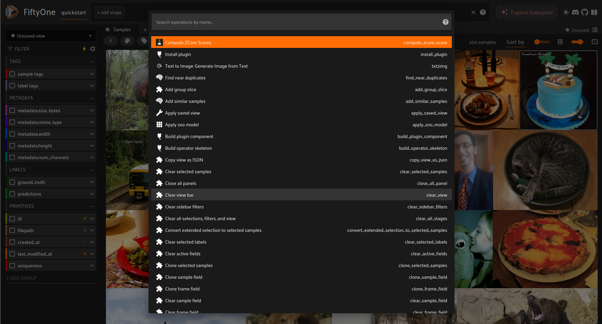
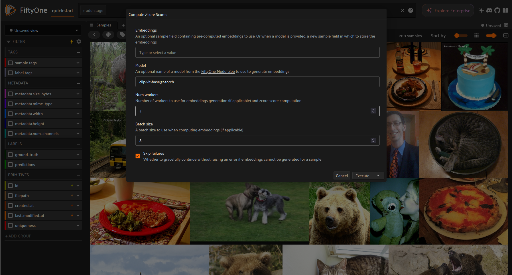
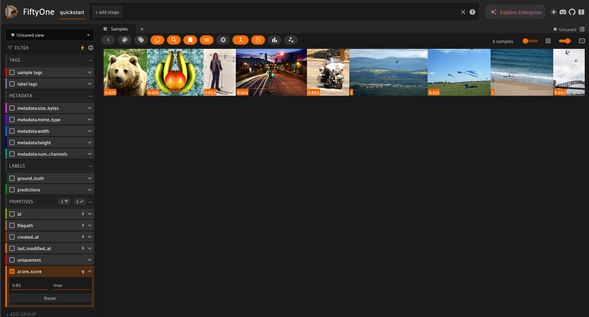
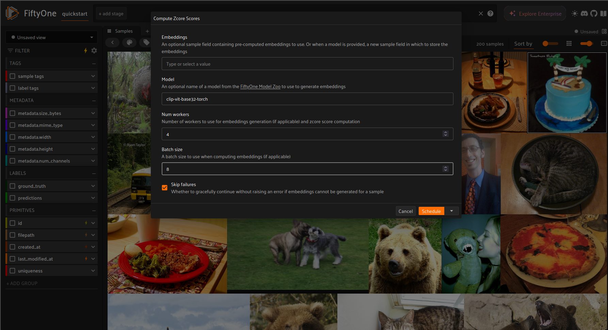
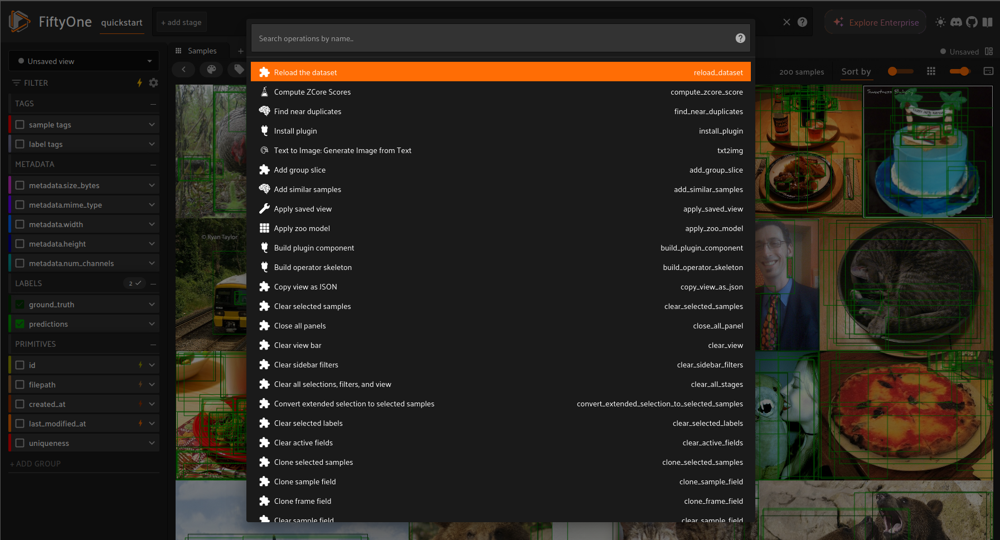

# zero-shot-coreset-selection
This implements https://arxiv.org/pdf/2411.15349, a zero shot coreset selection method on unlabeled image data. Selection is based on novel redundancy and coverage metrics in a foundation-model-generated embedding space.

Importantly, this method does NOT require:

- the presence of any labels
- training on (parts of) the dataset to be analyzed

## Notes on performance.

- The choice of embedding model matters. CLIP (https://arxiv.org/abs/2103.00020) is a good default.
- 1e6 is a reasonable upper bound for the number of samples drawn for coverage and redundancy estimation, even for very large datasets.
- Zcore scores are not necessarily meaningful between datasets. They should be applied and interpreted only within the dataset they were generated for.

## Usage

Generating zcore scores and selecting a coreset based on some threshold can be achieved in the app and programmatically.


### In the app

```python
import fiftyone.zoo as foz
import fiftyone as fo

dataset = foz.load_zoo_dataset(
    "quickstart", drop_existing_dataset=True, persistent=True
)

session = fo.launch_app(dataset)

session.wait()
```




*Select zcore operator*



*Choose appropriate parameterization*



*Choose coreset based on score threshold*

If you want to make use of multiprocessing in the app, use delegated execution of the operator.
In order to enable delegated execution, run ```fiftyone delegated launch``` in a separate terminal.
Then, launch the app as above and choose "schedule" instead of "execute" when running the operator.
Make sure that you have set ```export FIFTYONE_ALLOW_LEGACY_ORCHESTRATORS=true``` in the terminal
where you launch the app.
See [the docs](https://docs.voxel51.com/plugins/using_plugins.html#delegated-operations) for more info.



Then, monitor the local DO executor in the second terminal:

```bash
Running operation 68fa508ef152073068baa37a (<operator uri>)
...
Operator-specific logging
...
Operation 68fa508ef152073068baa37a complete
```
Then, reload the dataset in the app in order for the ```zcore_score``` sample field to get displayed.



### Programmatically

```python
import fiftyone.zoo as foz

dataset = foz.load_zoo_dataset(
    "quickstart", drop_existing_dataset=True, persistent=True
)
model = foz.load_zoo_model("clip-vit-base32-torch")
embeddings = dataset.compute_embeddings(model, batch_size=2)

# By default, use_multiprocessing is set to False
scores = zcore_scores(embeddings, use_multiprocessing=True, num_workers=4)

coreset = select_coreset(dataset, scores, coreset_size=10)
```

## Installation

```bash
# Install dependencies
pip install -r requirements.txt

# (Optional) Install pre-commit hooks
pip install pre-commit
pre-commit install
```

## TO DOs

- Add support for execution on views rather than only full dataset
- Add score computation on concatenated embedding vector from multiple foundation models
